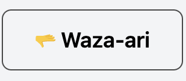
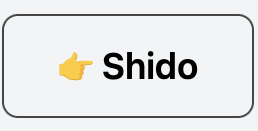
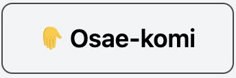
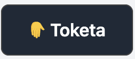
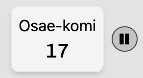
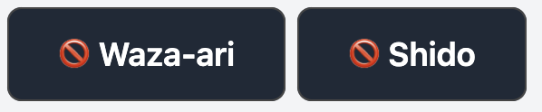

# JBCB Championship

## Aprire l'app e configurare il torneo

- Aprire il sito `https://jbcb-championship.vercel.app/`
- Accedere alle **Impostazioni**
- Inserire l'ID Torneo.

## Aprire la pagina per i risultati

- Andare in **Impostazioni**
- Cliccare su **Apri pagina**
- Si dovrebbe aprire un nuovo tab
- Spostare il nuovo tab sul beamer
- Premere il bottone in basso a destra per mettere la pagina a schermo intero

## Gestione delle categorie

### Visualizzare una categoria

- Cliccare su **Visualizza categorie**
- Cercare o selezionare categoria

> :warning: Se non vengono visualizzate le categorie corrette bisogna andare in **Impostazioni** e configurare l'ID corretto

Da questa pagina si può possono visualizzare diverse informazioni:

- Atleti iscritti
- Durata degli incontri
- Classifica
- Lista degli incontri con i rispettivi risultati
- Per categorie con doppia pool: classifica delle singole pool e tabellone finali
- Per categorie con doppia eliminazione: tabellone principale e tabellone di ripescaggio

### Visualizzare classifica

- Selezionare la categoria desiderata
- La classifica è disponibile solo al termine della categoria

### Stampare

- Selezionare la categoria desiderata
- Cliccare sul pulsante Stampa in alto a destra
- Se la finestra di stampa non si apre automaticamente, premere il pulsante in alto nella pagina.

## Gestione incontri

Dopo aver selezionato la categoria in alto a destra cliccare il bottone **Prossimo incontro**, se il bottone non è presente significa che la categoria è già terminata

### Avvio incontro

Premere il pulsante _play_. Premendo il pulsante _pausa_ il timer si blocca

### Ippon

Assegna la vittoria diretta e interrompe il timer dell'incontro

### Waza-ari

Dopo 2 waza-ari viene assegnata la vittoria. Se alla fine del tempo prestabilito uno dei due atleti ha 1 waza-ari viene assegnata la vittoria

### Shido

Dopo 3 shido viene assegnata la vittoria all'avversario. Per assegnare hansoku-make diretto premere 3 volte il pulsante per i shido

### Osae-komi / Toketa

Questi pulsanti sono attivi solo mentre il timer dell'incontro è attivo. Quando viene premuto la prima volta viene attivato il timer per l'osae-komi, se premuto la seconda volta (toketa) il timer per l'osae-komi si interrompe. Dopo 10 secondi viene assegnato 1 waza-ari, dopo 20 viene assegnato l'ippon

Se si preme il pulsante vicino al timer (sonomama) viene messo in pausa sia il timer dell'incontro che il timer dell'osae-komi. Premendo il play del timer entrambi i timer riprendono

### Correggere punteggio

A destra dei pulsanti per assegnare i punteggi è presente il bottone per correggere i punteggi (il bottone apparirà solo dopo aver assegnato almeno 1 punteggio)

Dopo essere entrati in modalità "correzione" è possibile rimuovere dei punteggi assegnati. Se bisogna correggere più punteggi è necessario ripetere questa operazione più volte

### Salvare l'incontro

Quando viene assegnata la vittoria ad un atleta compare il bottone _Termina l'incontro_, premendo questo bottone l'incontro viene salvato e viene aperto il prossimo incontro della categoria (o si ritorna alla pagina della categoria se non ci sono altri incontri)

    ❗
    Se si aggiorna la pagina o si ritorna alla categoria i dati non salvati andranno persi
    ❗

